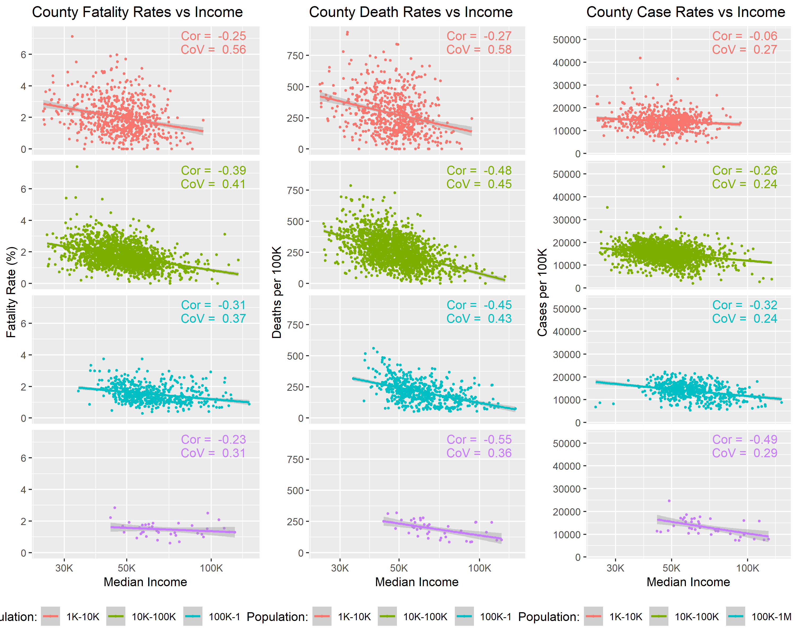

# Project 1
Authors: Karen, James, Brent, Kyle, Jacob, Keanu

Date: Oct. 20th 2021

## Project Goal & Question
The goal of this project was to analyze the relationship between median income of a county and how that might affect its COVID fatality rates, total cases, and total deaths. We wondered, “Would a higher median income lead to a lower fatality rate, and vice versa?” -[New York Times Github](https://github.com/nytimes/covid-19-data).

## Background
Coronavirus disease (COVID-19) is an infectious disease caused by the SARS-CoV-2 virus. Most people who catch COVID-19 have mild symptoms, but some people become severely ill. Over 44 Million people in the United States have gotten COVID-19. Over 700 Thousand people in the United States have died from COVID-19. Vaccines have been developed against COVID-19 to effectively protect populations

The COVID-19 pandemic has impacted different states and counties disproportionately and various factors are responsible, whether they be people’s lack of adherence to CDC guidelines or larger populations in more dense areas. The specific factor that we Team Zeta will be looking at is the role income may have on the severity of different areas COVID-19 numbers. 
Data Source & Background
In our exploration, we used income data as well as COVID cases and deaths data. Our income data is from the U.S. Census Bureau. Variables from that dataset include county and median income, grouped by different income brackets. Our COVID data is from the New York Times Github. Variables in this dataset include date, county, state, fips, cases, and deaths.

The US Census Bureau and New York Times are very reputable sources. The US Census Bureau’s data collection methods are well documented and shown on their website and NYT’s data collection procedures are well documented and especially cognizant of possible errors in recent COVID data reporting. The Github explains discrepancies in the data as well as their own analysis on how reliable it is.
What potential errors might be in the data? 
Potential errors include missing data. The county data we work with isn’t perfect; we’re missing about 22 counties out of 3,242 total counties. The US Census may have pre-selected for a number of counties based on their own criteria that they want to analyze, or may have omitted certain counties based on how they categorize territories.

Another error includes the reporting of accurate COVID data. “On several occasions, officials have corrected information hours or days after first reporting it. At times, cases have disappeared from a local government database, or officials have moved a patient first identified in one state or county to another, often with no explanation. In those instances, which have become more common as the number of cases has grown…”

# Analysis

Our presentation graph above depicts median income vs fatality rate, broken up into different population ranges (with the lower end of the scale showing populations under 10,000 and the higher end of the scale showing populations between a million and ten million). 

We found that correlation varies across all populations. None of them are particularly strong correlations (all <0.4), but all of them are negative. That indicates that an increase in median income loosely results in a decrease in fatality rate, across the board. 

Generally, the coefficient of variation decreases as the county population increases, which means that a bigger population decreases the spread in fatality rates. The min/max fatality rate of the smallest population size (1K - 10K) ranges from ~0 to ~7, whereas for the biggest population size (1M - 10M) this ranges from ~0.5 to ~3. The trendline also indicates a similar pattern, as the min/max of the trendline for the smallest population size goes from ~1 to ~3, whereas for the biggest population it goes from ~1.5 to ~2. 

Here, we have a “bigger picture” graph that adds county case and death rates per 100k, with the same grouping of county populations. On the x-axis is still median income. We see the same trend for the covariance term -- it generally decreases for both case and death rate as you increase the county size. The exception to this is the covariance term for the largest counties (1M - 10M), looking at their case rates, is larger than the covariance terms for other population sizes.

## Conclusion & Remaining Questions
Ultimately, our data points to a lack of a strong correlation for fatality rate vs median income and county population. You can see slightly stronger correlations for death and case rates per 100k vs median income and county population, but still nothing conclusive -- the highest correlation is -0.55 for death rate of the largest counties and median income. 

Visually, you can note that as counties funnel towards higher median incomes, the variation in fatality rate decreases regardless of county population size (with exception of the largest counties, which already have a small range in fatality rate).

Some remaining questions we have are:

If we had more big population counties (1M to 10M) in our data, how would that affect the correlation and coefficient of variance with median income?
How would further demographics data, like gender, age and race, affect this data analysis?
